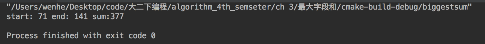

# 算法设计与分析 第二章

> 姓名：温和
>
> 班级：2016211308
>
> 学号：2016211350

------

## 最长公共序列

#### 代码：

```c++
#include <iostream>
#include <string>
#include <vector>
#include <fstream>

void read_data(std::vector<char> &A,std::vector<char> &B,std::vector<char> &C,std::vector<char> &D){
    std::fstream data;
    std::string temp;
    data.open("/Users/wenhe/Documents/我的坚果云/课件/大二下课件/算法设计与分析/上机作业-第3章-2018/附件1.最长公共子序列输入文件2017-4-26.txt",std::ios::in);
    data.seekg(std::ios::beg);
    data>>temp;data>>temp;A.assign(temp.begin(), temp.end());
    data>>temp;data>>temp;B.assign(temp.begin(), temp.end());
    data>>temp;data>>temp;C.assign(temp.begin(), temp.end());
    data>>temp;data>>temp;D.assign(temp.begin(), temp.end());
    data.close();
}

void print_data(std::vector<char> Chars){
    for(int i = Chars.size()-1;i >= 0;--i){
        std::cout << Chars[i];
    }
    std::cout<<std::endl;
}

std::vector<char> result(std::vector<char> &a,std::vector<char> &b){
    int length[a.size()][b.size()];
    int from[a.size()][b.size()];
    std::vector<char> answer;
    for(int i = 1;i < a.size();++i)
        length[i][0] = 0;
    for(int i = 1;i < b.size();++i)
        length[0][i] = 0;
    for(int i = 1;i < a.size();++i){
        for(int j = 1;j<b.size();++j){
            if(a[i] == b[j]){
                length[i][j] = length[i-1][j-1] + 1;
                from[i][j] = 1;
            }else if(length[i-1][j] >= length[i][j-1] ){
                length[i][j] = length[i-1][j];
                from[i][j] = 2;
            }else{
                length[i][j] = length[i][j-1];
                from[i][j] = 3;
            }
        }
    }
    int j = b.size() - 1;
    int i = a.size() - 1 ;
    while(i!=0 && j!=0){
        if(from[i][j] == 1){
            answer.push_back(a[i]);
            i--,j--;
        }else if(from[i][j] == 2){
            i--;
        }else{
            j--;
        }
    }
    return answer;
}

int main(){
    std::vector<std::vector<char>> data;
    std::vector<char> temp;
    data.assign(4,temp);
    read_data(data[0], data[1], data[2], data[3]);
    temp = result(data[3],data[2]);
    print_data(temp);
}
```

#### 实验结果：

* 所有序列的最长公共序列都是 ：
  * `an+algorithm+is+any+welldefined+computational+procedure+that+takes+some+values+as+input+and+produces+some+values+as+output`

#### 运行截图：


------

## 最大字段和

#### 代码：

```c++
#include <iostream>
#include <fstream>
#include <vector>

void read_data(std::vector<int> &data){
    std::fstream file;
    int temp;
    file.open("/Users/wenhe/Documents/我的坚果云/课件/大二下课件/算法设计与分析/上机作业-第3章-2018/附件2.最大子段和输入数据2017-序列2.txt",std::ios::in);
    while(!file.eof()){
        file>>temp;
        data.push_back(temp);
    }
}

void get_sum(std::vector<int> data){
    int start = 0,end = 0;
    int sum = 0,sum_before = 0;
    for(int i = 0;i<data.size();++i){
        if(sum_before > 0){
            sum_before += data[i];
        }else{
            sum_before = data[i];
            start = i;
            end = i;
        }
        if(sum_before > sum){
            sum = sum_before;
            end = i;
        }
    }
    std::cout<<"start: "<<start<<" end: "<<end<<" sum:"<<sum<<std::endl;
}

int main()
{
    std::vector<int> data;
    read_data(data);
    get_sum(data);
    return 0;
}
```

#### 实验结果：

* 第一组为：
  * 42 到 328，最大和为 2715
* 第二组为：
  * 71 到 141，最大和为 377

#### 运行截图：




------

## 凸多边形三角剖分：

#### 代码：

```c++
#include <iostream>
#include <fstream>
#include <cmath>
#include <vector>

#define PI 3.14159265
#define R (6.371229*1e6)

struct node {
    double longitude;
    double latitude;
    double dist;
    int num;
};

void read_data(std::vector<struct node> &data, const std::string &filename) {
    std::fstream f;
    f.open("/Users/wenhe/Documents/我的坚果云/课件/大二下课件/算法设计与分析/上机作业-第3章-2018/" + filename, std::ios::in);
    while (!f.eof()) {
        struct node temp;
        f >> temp.longitude >> temp.latitude >> temp.num;
        //std::cout<<"No: "<<temp.num<<" l: "<<temp.longitude<<" a: "<<temp.latitude<<std::endl;
        data.push_back(temp);
    }
    f.close();
}

double get_rad(double d) {
    return (d * PI / 180);
}

double get_dist(const struct node &d1, const struct node &d2) {
    double lat1 = d1.latitude;
    double lat2 = d2.latitude;
    double lon1 = d1.longitude;
    double lon2 = d2.longitude;
    double rad_lat_1 = get_rad(lat1);
    double rad_lat_2 = get_rad(lat2);
    double a = rad_lat_1 - rad_lat_2;
    double b = get_rad(lon1) - get_rad(lon2);
    double dist = 2 * asin(sqrt(pow(sin(a / 2), 2) + cos(rad_lat_1) * cos(rad_lat_2) * pow(sin(b / 2), 2)));
    dist = dist * R;
    return dist;
}

double get_c(const struct node &a, const struct node &b, const struct node &c) {
    return get_dist(a, b) + get_dist(b, c) + get_dist(a, c);
}

void print_graph(std::vector<std::vector<int>> &partner, int i, int j) {
    if (j - i >= 1) {
        std::cout << i - 1 << " " << partner[i][j] << " " << j << std::endl;
        print_graph(partner, i, partner[i][j]);
        print_graph(partner, partner[i][j] + 1, j);
    }
}

void triangulate(const std::vector<struct node> data) {
    std::vector<std::vector<double>> t(data.size(), std::vector<double>(data.size(), 0));
    std::vector<std::vector<int>> partner(data.size(), std::vector<int>(data.size(), 0));
    double current;
    for (int i = 1; i < data.size(); ++i) {
        t[i][i] = 0;
    }
    for (int r = 2; r < data.size(); ++r) {
        for (int i = 1; i < data.size() - r + 1; ++i) {
            int j = i + r - 1;
            t[i][j] = t[i + 1][j] + get_c(data[i - 1], data[i], data[j]);
            partner[i][j] = i;
            for (int k = i + 1; k < j; ++k) {
                current = t[i][k] + t[k + 1][j] + get_c(data[i - 1], data[k], data[j]);
                if (current < t[i][j]) {
                    t[i][j] = current;
                    partner[i][j] = k;
                }
            }
        }
    }
    std::cout << "min weight: " << t[1][data.size() - 1] << std::endl;
    print_graph(partner, 1, data.size() - 1);
}

int main() {
    std::vector<struct node> data1, data2;
    read_data(data1, "tri1.txt");
    read_data(data2, "tri2.txt");
    triangulate(data1);
    triangulate(data2);
    return 0;
}
```

#### 实验结果：


#### 运行截图：


------

## 0-1背包问题

#### 代码：

```c++
#include <iostream>
#include <vector>
#include <fstream>
#include <cmath>

void read_data(std::vector<int> &value, std::vector<int> &weight, int &bag_size, const std::string &filename, int n) {
    std::fstream f;
    f.open("/Users/wenhe/Documents/我的坚果云/课件/大二下课件/算法设计与分析/上机作业-第3章-2018/" + filename, std::ios::in);
    f >> bag_size;
    for (int i = 0; i < n; ++i) {
        int temp;
        f >> temp;
        weight.push_back(temp);
    }
    for (int i = 0; i < n; ++i) {
        int temp;
        f >> temp;
        value.push_back(temp);
    }
    f.close();
}

void knapsack(const std::vector<int> &value, const std::vector<int> &weight, int limited) {
    int n = int(value.size() - 1);
    int bag_size = limited;
    std::vector<std::vector<int>> m(value.size() + 1, std::vector<int>(bag_size + 1, 0));
    std::vector<int> result;
    int jMax = (weight[n] - 1) >= bag_size ? bag_size : (weight[n] - 1);
    for (int j = 0; j <= jMax; j++) {
        m[n][j] = 0;
    }
    for (int j = weight[n]; j <= bag_size; ++j) {
        m[n][j] = value[n];
    }
    for (int i = n - 1; i > 1; --i) {
        if ((weight[i] - 1) >= limited)
            jMax = limited;
        else
            jMax = weight[i] - 1;
        for (int j = 0; j <= jMax; ++j) {
            m[i][j] = m[i + 1][j];
        }
        for (int j = weight[i]; j <= limited; ++j) {
            if (m[i + 1][j] < m[i + 1][j - weight[i]] + value[i]) {
                m[i][j] = m[i + 1][j - weight[i]] + value[i];
            } else
                m[i][j] = m[i + 1][j];
        }
    }
    m[1][limited] = m[2][limited];
    if (bag_size >= weight[1])
        m[1][bag_size] =
                m[1][bag_size] >= (m[2][bag_size - weight[1]] + value[1]) ? m[1][bag_size] : (
                        m[2][bag_size - weight[1]] +
                        value[1]);

    for (int i = 1; i < n; ++i) {
        if (m[i][bag_size] != m[i + 1][bag_size]) {
            result.push_back(i);
            bag_size -= weight[i];
        }
    }
    std::cout << "m[n][limited]:" << m[n][limited] << std::endl;
    if (m[n][limited] > 0)
        result.push_back(n);
    int total_weight = 0, total_value = 0;
    for (auto i :result) {
        std::cout << i << " ";
        total_weight += weight[i];
        total_value += value[i];
    }
    std::cout << std::endl << "value: " << total_value << " weight: " << total_weight << std::endl;
}

int main() {
    std::vector<int> weight1, weight2, value1, value2;
    int bag_size1, bag_size2;
    read_data(value1, weight1, bag_size1, "bag1.txt", 50);
    read_data(value2, weight2, bag_size2, "bag2.txt", 100);
    knapsack(value1, weight1, bag_size1);
    knapsack(value2, weight2, bag_size2);
    return 0;
}
```

#### 实验结果：

* 第一组为：
  * 编号为 0 1 3 7 8 10 17 19 22 23 24 25 31 32 34 37 42 43 44 49 （都需 + 1）的物品被放入包中
  * 总重为 298，总价值为 1085
* 第二组为：
  * 编号为 0 4 5 8 10 20 21 22 24 26 30 41 48 51 53 54 57 59 60 76 79 80 81 82 83 87 88 94 （都需 + 1）的物品被放入包中
  * 总重为 598，总价值为 1568

#### 运行截图：

